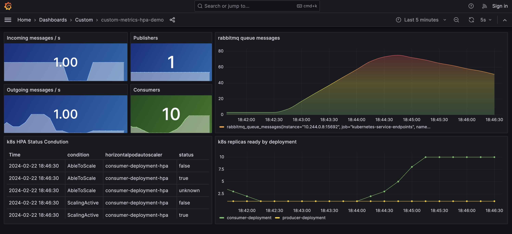

# custom-metrics-hpa-demo

This project demonstrates how to use custom metrics for autoscaling deployments.

The consumer app will autoscale based on rabbitmq queue length.



## Components

* **kubernetes**: For running our containers
  * **kube-state-metrics**: Exposes k8s metrics for monitoring
  * **hpa**: autoscales our consumer deployment
* **prometheus**: Metric datastore and metric scraper
* **prometheus-adapter**: Implements custom metrics api for HPA
* **rabbitmq cluster**: Message broker which we will scrape custom metrics
* **producer & consumer app**: Python apps to generate and consume messages
* **grafana**: For watching this demo in action

## Requirements

* docker (+25.0.3)
* kubectl (+v1.29.2)
* Python (+3.10)
* minikube (+1.32.0)

## Instructions

### Deploy the setup

1. Install docker and minikube.
2. Start the cluster.

    ```bash
    minikube start
    ```

3. Deploy the setup.

    ```bash
    make deploy
    ```

> [!TIP] Useful commands
>
> ```bash
> make deploy # deploys the setup
> make clean # deletes the setup
> ```

### Monitoring

1. Launch grafana UI

    ```bash
    minikube --namespace=monitoring service grafana-service
    ```

2. `CMD+k` or search for dashboard `custom-metrics-hpa-demo`.

> [!NOTE]
> It may take a few minutes for the systems to fully spin up for everything
> to load smoothly.
